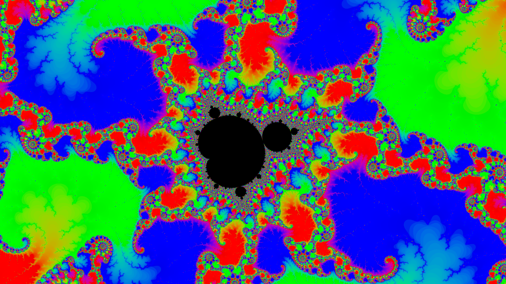
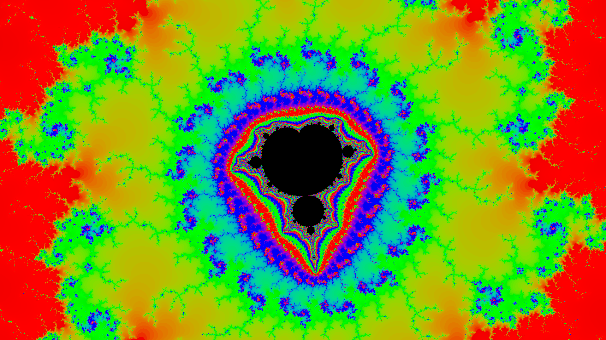
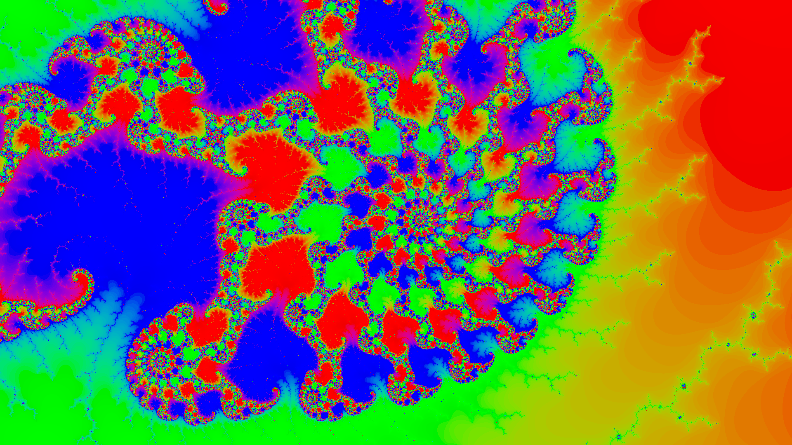

# Fractal Viewer

This is a mandelbrot set viewer written for fun bc it looks weird and cool to me. It's called fractal because it's easy to change the fractal in the code, and I would like to have some sort of simple scripting language for it eventually.

It's normal rust, so `cargo run` should fully compile and start it. It requires nightly to help with fixed point operations.

## Features

- Kind of infinite zoom in; dynamic precision, so wgsl, your vram, and your patience are the limiting factors
- GPU based; not very optimized, but fast enough to be comfortable for relatively deep zooms
- Does not stop iterating; can look noisy when dense, but doesn't "hide" detail from you (given enough time)
- Real time movement controls for easy exploration
- Snapshot feature for movement & zoom sanity when you're trying to go somewhere specific, needed because it resets the texture every time you move or zoom in
- The color is hue rotated as the iterations go up, from red to green to blue and back to red; not the most pleasant looking, but shows you a lot of detail which is the focus

## Controls

 - WASD for movement
 - Scroll to zoom
 - Q to take a snapshot

Snapshots will copy the current texture and let you view it as the new one generates, which is very important for your sanity when you zoom in really far; the undecided regions will be replaced with a darkened version of your snapshot, so you can still know where you are and move around.

## Details

- It uses my own, probably incorrect dynamic precision fixed point number implementation in both rust and wgsl
- Regions where it's unclear whether it diverges are drawn black, and updated if it finds divergence; one distinct feature is that it just keeps iterating, it doesn't have a max like most viewers do, and it updates the colors in real time as it finds divergence. This process can be pretty cool to watch, especially in spiral areas.
- When you zoom in far enough, it will automatically update the fixed point precision and recompile the shader so the quality doesn't drop off; it will go as far as your GPU / wgpu lets it
- There are basically no optimizations other than each iteration tries to do minimal fixed point operations, which does not include copying, but you can actually get pretty deep with reasonable draw time.
- The shader (`src/client/render/compute/shader.wgsl`) can easily be modified to draw other fractals, given there's fixed point support for them, such as the burning ship. Ideally I'd like to have a scripting language that can be translated to shaders, and hot reload so people can easily change the equation and see what happens.
- While I think some of the code is written well, there are many areas right now that have a lot of dead code or are split up too much or named weird. This is partly because I was originally trying to write a tile renderer, which would be really nice for caching, but then found snapshots to be a much easier and in some ways better (infinite iters) solution. It's also because this is the first time I've implemented fixed point numbers, and so there's probably bugs. Some of the rendering positioning & scale is also not very coherent because I got close and just wanted things to work, would like to clean that up as well.

## Known Bugs

- It crashes when you zoom out too far (relative to the starting view), because the renderer is currently not designed for zooming out, only in. This does not matter at all for fractals like the mandelbrot set where the detail is confined in a small circle (radius 2). An easy fix would be to cap the zoom, but I'm more interested in having the precision expand in the opposite direction as well for equations that require it (no clue if those exist).
- The snapshot texture gets stretched in some way when you resize the window. Don't know exactly why because that code was trial and errored (just wanted it to work), but I think I know where the fix would be and it shouldn't be complicated. Not a critical issue at all though, it only affects the previously taken snapshot.

## TODO List

not in order of priority

- fix known bugs
- remove old chunk rendering code
- allow for hot reloading shader, or if I have enough time write a small scripting language for it to make it easy
- maybe add option to render at 2x screen size and then sample for better quality / less noise
- add auto snapshot; hard to figure out exactly when to take; maybe wait until at iter threshold dependent on zoom?
- add ability to have multiple snapshots at once, so you can easily navigate around; also fade out snapshots that are far away zoom wise; also maybe save manual ones to disk so you can easily contiune exploring areas
- add checkpointing that somehow lets you save & return to locations; even if this isn't added, add camera reset to easily get back to initial state; would also let you share locations with other people
- zoom in on mouse
- others controls for mouse; click & drag to move, maybe right click could be snapshot

## Cool Screenshots

